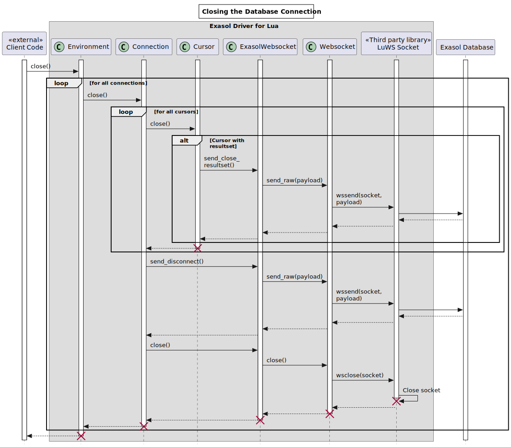

<head><link href="oft_spec.css" rel="stylesheet"></head>

# Introduction

## Acknowledgments

This document's section structure is derived from the "[arc42](https://arc42.org/)" architectural template by Dr. Gernot Starke, Dr. Peter Hruschka.

# Constraints

This section introduces technical system constraints.

# Solution Strategy

EDL uses Exasol's public [websocket-api](https://github.com/exasol/websocket-api) because it's a stable interface, well documented and does not require native libraries.

## Requirement Overview

Please refer to the [System Requirement Specification](system_requirements.md) for user-level requirements.

# Building Blocks

# Runtime

## Connecting to the Database

## Executing a Statement

## Closing the Connection

# Cross-cutting Concerns

## Websocket Request/Response

# Design Decisions

# Quality Scenarios

# Risks
