# Introduction

## Acknowledgments

This document's section structure is derived from the "[arc42](https://arc42.org/)" architectural template by Dr. Gernot Starke, Dr. Peter Hruschka.

# Constraints

This section introduces technical system constraints.

## Restrict Libraries to the Ones Available to Exasol UDFs

`dsn~use-available-exasol-udf-libraries-only~1`

EDL uses the following external Lua modules that are available to Exasol UDFs:
* `luasocket`
* `luasec`
* `luaossl`
* `lua-cjson`

EDL uses the following external Lua modules that can be amalgamated into a single package:
* exaerror
* remotelog

EDL does not use other external modules not listed here.

Rationale:

This will allow EDL to run inside an Exasol UDF.

Covers:

* [const~use-available-exasol-udf-libraries-only~1](./system_requirements.md#restrict-libraries-to-the-ones-available-to-exasol-udfs)

Needs: itest

# Solution Strategy

EDL uses Exasol's public [websocket-api](https://github.com/exasol/websocket-api) because it's a stable interface, well documented and does not require native libraries.

## Requirement Overview

Please refer to the [System Requirement Specification](system_requirements.md) for user-level requirements.

# Building Blocks

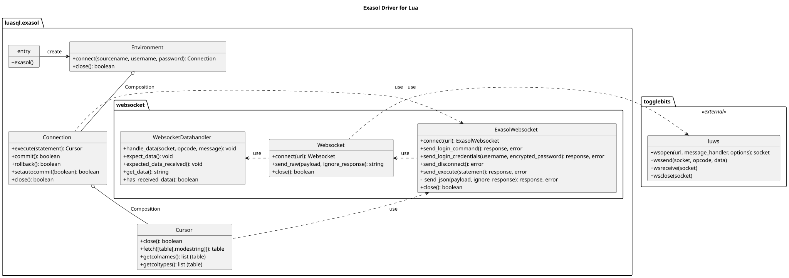

See [Diagram source](./model/diagrams/class/cl_exasol_driver_lua.plantuml).

# Runtime

Note: the following sequence diagrams only show a simplified workflow without the `Websocket` class and `luws`. See section [Websocket Request/Response](#websocket-requestresponse) for a detailed description of the request/response cycle.

## Environment

### Connecting to the Database
`dsn~env-connect~1`

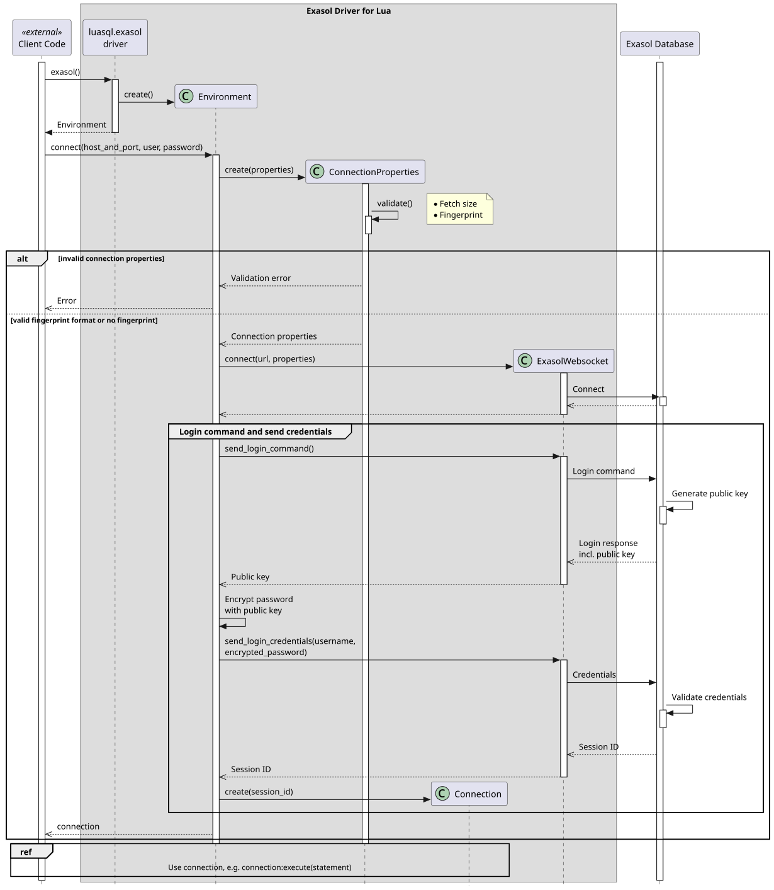

See [Diagram source](./model/diagrams/sequence/seq_environment_connect.plantuml).

### TLS Certificate Fingerprint Pinning

The driver validates the optional `fingerprint` connection property in `ConnectionProperties` before opening a socket. `Websocket` forwards a valid fingerprint to the bundled LuWS options. After LuaSec completes the TLS handshake, LuWS reads the peer certificate, derives its SHA-256 fingerprint from the binary DER encoding, and compares it case-insensitively with the configured fingerprint. LuWS only upgrades the connection to WebSocket after a successful comparison. On a mismatch or unavailable certificate data, LuWS closes the TLS socket and returns a safe error without initiating the WebSocket upgrade or Exasol login.

#### Connect Without a Fingerprint
`dsn~skip-certificate-fingerprint-verification~1`

When no fingerprint is configured, `ConnectionProperties`, `Websocket`, and LuWS preserve the existing TLS connection flow and do not inspect the peer certificate.

Covers:
* `scn~connect-without-certificate-fingerprint~1`

Needs: impl, utest, itest

#### Reject a Malformed Fingerprint
`dsn~validate-certificate-fingerprint~1`

`ConnectionProperties:create()` rejects missing, non-string, or malformed fingerprints before `Websocket.connect()` is invoked.

Covers:
* `scn~reject-malformed-certificate-fingerprint~1`

Needs: impl, utest

#### Connect With a Matching Fingerprint
`dsn~tls-certificate-fingerprint-pinning~1`

LuWS verifies a configured fingerprint after a successful TLS handshake and before calling `wsupgrade()`. A matching fingerprint permits the normal WebSocket upgrade and login flow to continue.

Covers:
* `scn~connect-with-matching-certificate-fingerprint~1`

Needs: impl, utest, itest

#### Reject a Mismatching Fingerprint
`dsn~reject-mismatching-certificate-fingerprint~1`

LuWS closes and clears the TLS socket when its calculated fingerprint differs from the configured fingerprint. It returns a mismatch error without calling `wsupgrade()` or allowing login commands or credentials to be sent.

Covers:
* `scn~reject-mismatching-certificate-fingerprint~1`

Needs: impl, utest, itest

### Closing the Environment
`dsn~env-close~1`

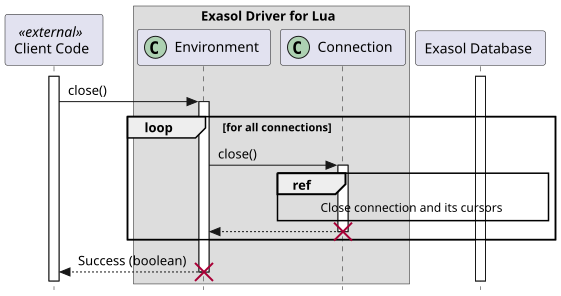

See [Diagram source](./model/diagrams/sequence/seq_environment_close.plantuml).

## Connection

### Executing a Statement

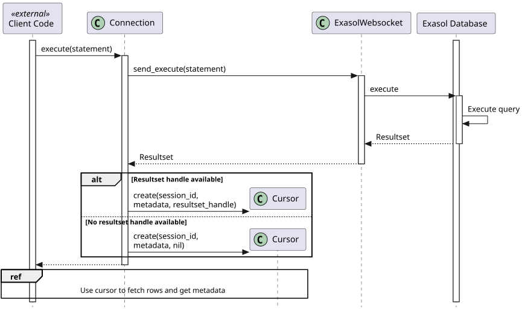

See [Diagram source](./model/diagrams/sequence/seq_connection_execute.plantuml).

### Setting Autocommit for the Connection

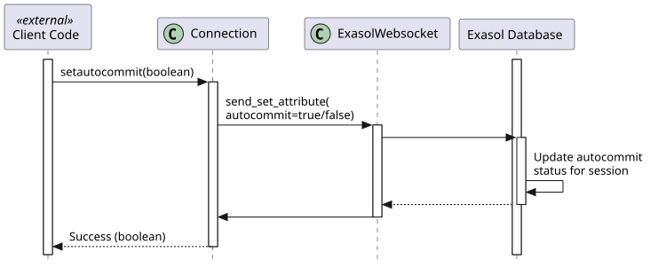

See [Diagram source](./model/diagrams/sequence/seq_connection_setautocommit.plantuml).

### Committing a Transaction for the Connection

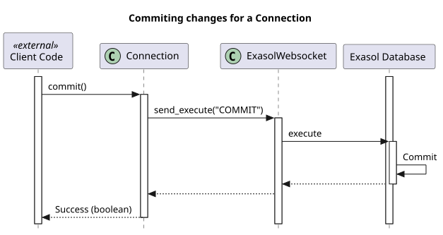

See [Diagram source](./model/diagrams/sequence/seq_connection_commit.plantuml).

### Rolling Back a Transaction for the Connection

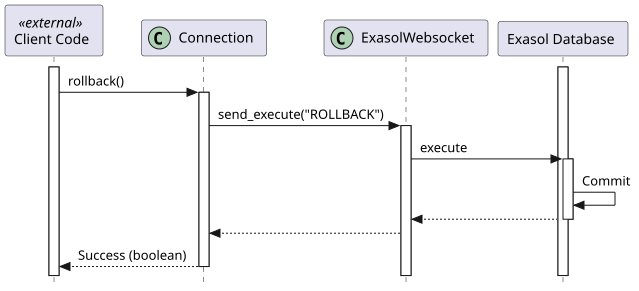

See [Diagram source](./model/diagrams/sequence/seq_connection_rollback.plantuml).

### Closing the Connection

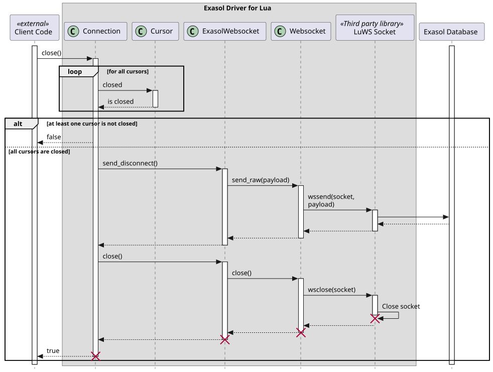

See [Diagram source](./model/diagrams/sequence/seq_connection_close.plantuml).

## Cursor

### Fetching Results

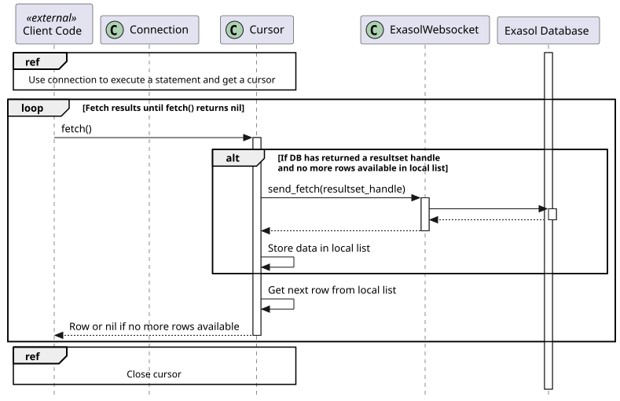

See [Diagram source](./model/diagrams/sequence/seq_cursor_fetch.plantuml).

### Getting Column Names

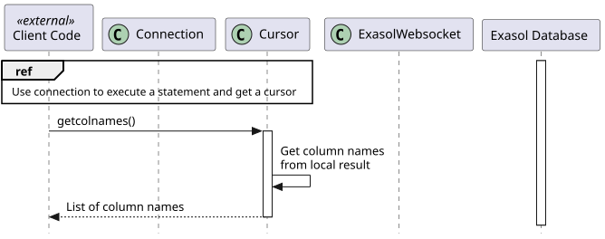

See [Diagram source](./model/diagrams/sequence/seq_cursor_getcolnames.plantuml).

### Getting Column Types

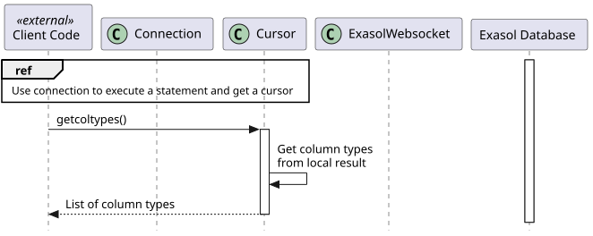

See [Diagram source](./model/diagrams/sequence/seq_cursor_getcoltypes.plantuml).

### Closing a Cursor

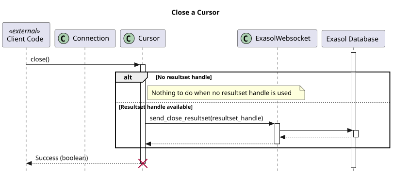

See [Diagram source](./model/diagrams/sequence/seq_cursor_close.plantuml).

# Cross-cutting Concerns

## Websocket Request/Response

### Timeout Ownership and Error Propagation
`dsn~websocket-timeout-coordination~1`

LuWS owns the timeout that detects the absence of WebSocket traffic. It returns a distinct, timeout result to `Websocket` clearly distinguishable from ordinary "no data available" polling.

`Websocket` stops waiting immediately on that signal. The receive-loop ends and `Websocket` does not send another application-level
WebSocket command on the timed-out session.

Needs: impl, utest

### Websocket Safety Deadline
`dsn~websocket-safety-deadline~1`

`Websocket` may use a safety deadline only when it is longer than the LuWS wire-level timeout, so it cannot mask a LuWS timeout. Its error identifies the expired `Websocket` deadline without a LuWS result. Timeout errors state the layer, operation, and elapsed timeout without sensitive or unbounded data. A timed-out session sends no further application-level requests, including during cleanup.

Needs: impl, utest

### Websocket Connection

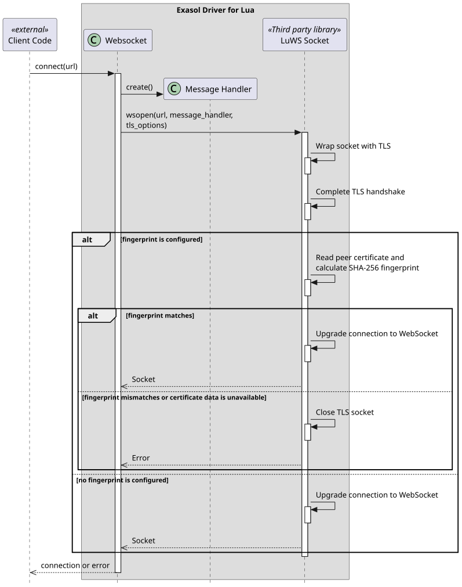

See [Diagram source](./model/diagrams/sequence/seq_websocket_connect.plantuml).

### Websocket Execute

Detailed request and response cycle using `connection:execute()` as an example:

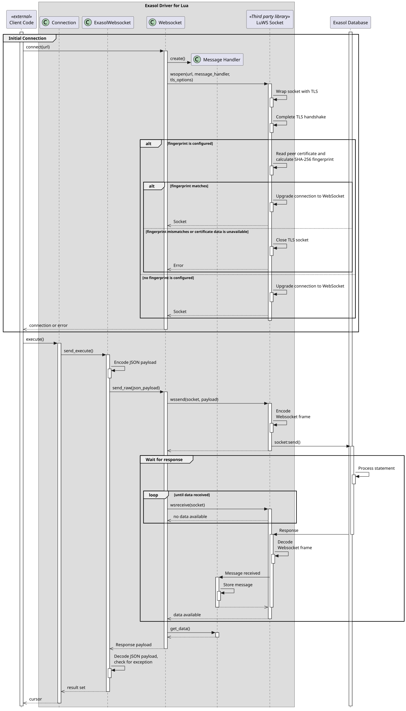

See [Diagram source](./model/diagrams/sequence/seq_websocket_request_response.plantuml).

## Logging with remotelog
`dsn~logging-with-remotelog~1`

EDL uses [remotelog](https://github.com/exasol/remotelog-lua) for logging.

Rationale:

This library can log to the console and a remote receiver and is already used in other projects at Exasol.

Note:

EDL is a library that is used by other applications. That's why EDL does not configure log level or application name. This is the task of the application using EDL.

Covers:
* `req~console-logging~1`
* `req~remote-logging~1`

Needs: impl, utest

# Design Decisions

## Included Third-Party Lua Modules

We include the source code of some third party Lua modules in this repository. This section explains the rationale.

### [luws.lua](../src/luasql/exasol/luws.lua)

This module from [github.com/toggledbits/LuWS](https://github.com/toggledbits/LuWS) implements the WebSocket protocol. We include it's source code for the following reasons:

* The module is not published at [LuaRocks](https://luarocks.org/)
* The module requires modifications to work with Lua 5.4 and the original author requires backwards compatibility. See discussion at [LuWS issue #3](https://github.com/toggledbits/LuWS/issues/3).

### [base64.lua](../src/luasql/exasol/base64.lua)

This module from [github.com/iskolbin/lbase64](https://github.com/iskolbin/lbase64) implements a base64 encoder and decoder. We include it's source code for the following reasons:

* The module is not available in an Exasol UDF (see [list of auxiliary libraries](https://docs.exasol.com/db/latest/database_concepts/udf_scripts/lua.htm#AuxiliaryLibraries) for UDFs).
* The module uses the `load()` function for backwards compatibility with older Lua versions (see [the source code](https://github.com/iskolbin/lbase64/blob/master/base64.lua#L48-L50) for details). This `load()` function is not available in Exasol UDFs, so we had to modify the relevant code, breaking base64's backwards compatibility.

# Quality Scenarios

# Risks
