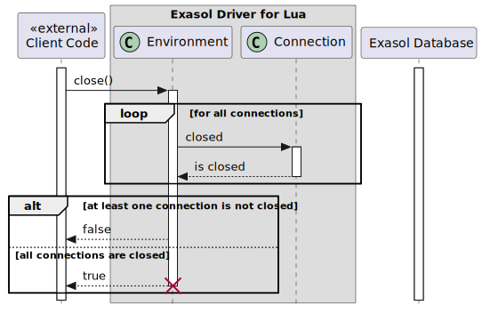
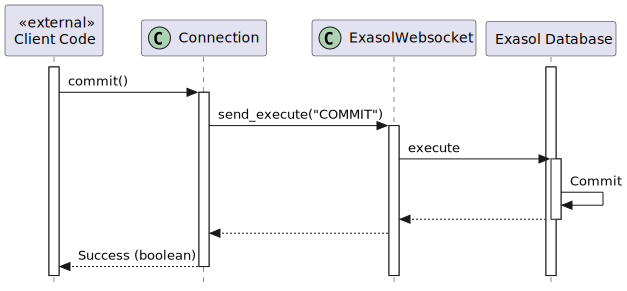
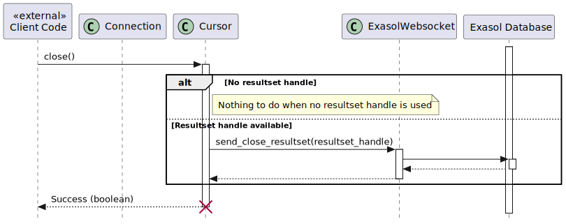

# Introduction

## Acknowledgments

This document's section structure is derived from the "[arc42](https://arc42.org/)" architectural template by Dr. Gernot Starke, Dr. Peter Hruschka.

# Constraints

This section introduces technical system constraints.

## Restrict Libraries to the Ones Available to Exasol UDFs

`const~use-available-exasol-udf-libraries-only~1`

EDL uses the following external Lua modules that are available to Exasol UDFs:
* luasocket
* luasec
* luaossl
* lua-cjson

EDL uses the following external Lua modules that can be amalgamated into a single package:
* exaerror
* remotelog

EDL does not use other external modules not listed here.

Rationale:

This will allow EDL to run inside an Exasol UDF.

Covers:

* [feat~run-in-exasol-udf~1](./system_requirements.md#run-inside-an-exasol-udf)

Needs: itest

# Solution Strategy

EDL uses Exasol's public [websocket-api](https://github.com/exasol/websocket-api) because it's a stable interface, well documented and does not require native libraries.

## Requirement Overview

Please refer to the [System Requirement Specification](system_requirements.md) for user-level requirements.

# Building Blocks

See [Diagram source](./model/diagrams/class/cl_exasol_driver_lua.plantuml).

# Runtime

Note: the following sequence diagrams only show a simplified workflow without the `Websocket` class and `luws`. See section [Websocket Request/Response](#websocket-requestresponse) for a detailed description of the request/response cycle.

## Environment

### Connecting to the Database
`dsn~env-connect~1`

See [Diagram source](./model/diagrams/sequence/seq_environment_connect.plantuml).

### Closing the Environment
`dsn~env-close~1`

See [Diagram source](./model/diagrams/sequence/seq_environment_close.plantuml).

## Connection

### Executing a Statement

See [Diagram source](./model/diagrams/sequence/seq_connection_execute.plantuml).

### Setting Autocommit for the Connection

See [Diagram source](./model/diagrams/sequence/seq_connection_setautocommit.plantuml).

### Committing a Transaction for the Connection

See [Diagram source](./model/diagrams/sequence/seq_connection_commit.plantuml).

### Rolling Back a Transaction for the Connection

See [Diagram source](./model/diagrams/sequence/seq_connection_rollback.plantuml).

### Closing the Connection

See [Diagram source](./model/diagrams/sequence/seq_connection_close.plantuml).

## Cursor

### Fetching Results

See [Diagram source](./model/diagrams/sequence/seq_cursor_fetch.plantuml).

### Getting Column Names

See [Diagram source](./model/diagrams/sequence/seq_cursor_getcolnames.plantuml).

### Getting Column Types

See [Diagram source](./model/diagrams/sequence/seq_cursor_getcoltypes.plantuml).

### Closing a Cursor

See [Diagram source](./model/diagrams/sequence/seq_cursor_close.plantuml).

# Cross-cutting Concerns

## Websocket Request/Response

Detailed Websocket Request and Response cycle using `connection:execute()` as an example:

See [Diagram source](./model/diagrams/sequence/seq_websocket_request_response.plantuml).

## Logging with remotelog
`dsn~logging-with-remotelog~1`

EDL uses [remotelog](https://github.com/exasol/remotelog-lua) for logging.

Rationale:

This library can log to the console and a remote receiver and is already used in other projects at Exasol.

Note:

EDL is a library that is used by other applications. That's why EDL does not configure log level or application name. This is the task of the application using EDL.

Covers:
* `req~console-logging~1`
* `req~remote-logging~1`

Needs: impl, utest

# Design Decisions

# Quality Scenarios

# Risks
