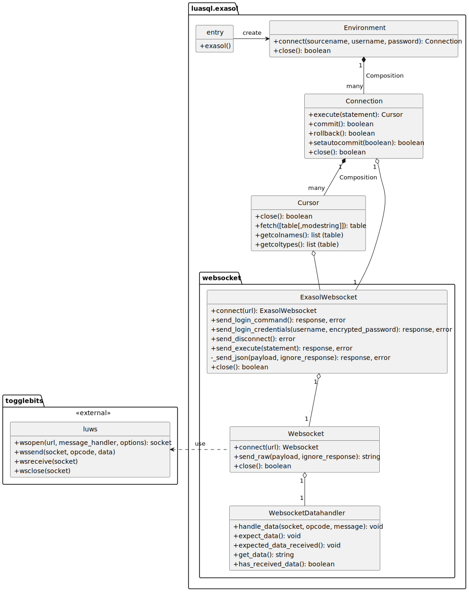

<head><link href="oft_spec.css" rel="stylesheet"></head>

# Introduction

## Acknowledgments

This document's section structure is derived from the "[arc42](https://arc42.org/)" architectural template by Dr. Gernot Starke, Dr. Peter Hruschka.

# Constraints

This section introduces technical system constraints.

# Solution Strategy

EDL uses Exasol's public [websocket-api](https://github.com/exasol/websocket-api) because it's a stable interface, well documented and does not require native libraries.

## Requirement Overview

Please refer to the [System Requirement Specification](system_requirements.md) for user-level requirements.

# Building Blocks

See [Diagram source](./model/diagrams/class/cl_exasol_driver_lua.plantuml).

# Runtime

## Connecting to the Database

See [Diagram source](./model/diagrams/sequence/seq_connection.plantuml).

## Executing a Statement and Fetching Results

See [Diagram source](./model/diagrams/sequence/seq_execute_statement.plantuml).

## Closing the Connection

See [Diagram source](./model/diagrams/sequence/seq_close.plantuml).

# Cross-cutting Concerns

## Websocket Request/Response

See [Diagram source](./model/diagrams/sequence/seq_websocket_request_response.plantuml).

## Logging with remotelog
`dsn~logging-with-remotelog~1`

EDL uses [remotelog](https://github.com/exasol/remotelog-lua) for logging.

Rationale:

This library can log to the console and a remote receiver and is already used in other projects at Exasol.

Note:

EDL is a library that is used by other applications. That's why EDL does not configure log level or application name. This is the task of the application using EDL.

Covers:
* `req~console-logging~1`
* `req~remote-logging~1`

Needs: impl

# Design Decisions

# Quality Scenarios

# Risks
